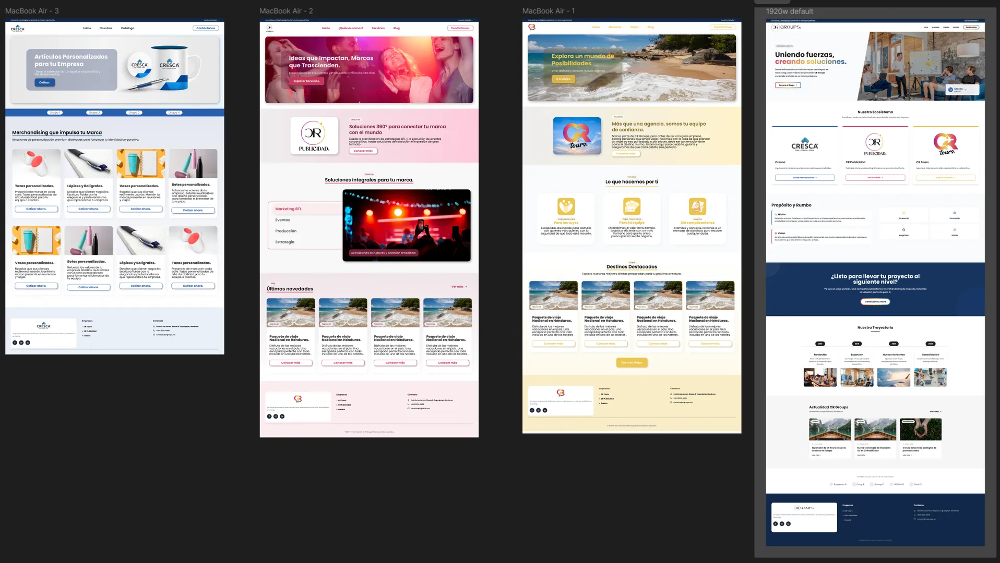
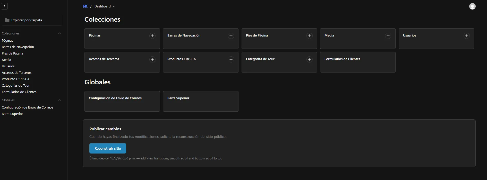
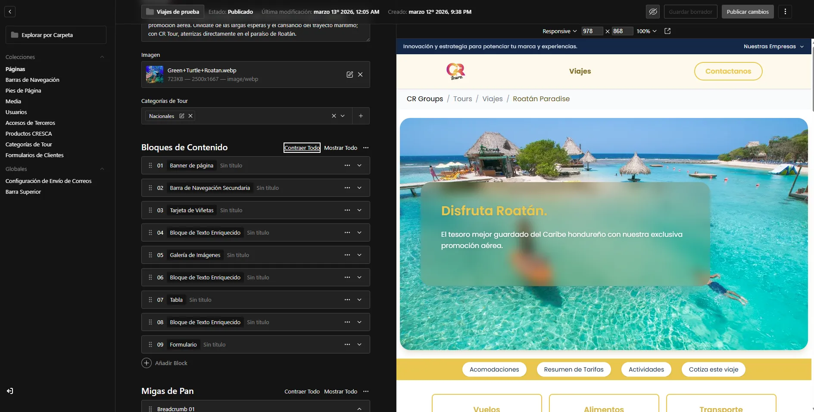

# Descripción del Proyecto
Desarrollo de una plataforma corporativa integral para **CR Groups Honduras**, diseñada para centralizar y gestionar los micrositios de sus diversas unidades de negocio: **CR Tours**, **CR Publicidad** y **CRESCA**. El sistema permite que cada empresa mantenga su identidad propia dentro de una infraestructura tecnológica compartida.

### Requisitos Clave
* **Arquitectura Multi-sitio:** Un portal principal con sub-sitios dinámicos para cada unidad de negocio.
* **Funcionalidad Específica por Unidad:** 
    * **CR Tours:** Gestión de viajes por categorías con sistema de cotización integrado.
    * **CRESCA:** Catálogo de productos especializado con flujo de cotizaciones.
* **Autogestión Total:** Control absoluto del contenido y estructura por parte de los administradores.
* **Rendimiento Óptimo:** Implementación de Generación de Sitios Estáticos (SSG) para una carga instantánea.
* **Componentes Universales:** Sistema de diseño con componentes compartidos que adaptan su apariencia según el branding de cada unidad.

---

## Diseño y Concepto
El proceso comenzó en **Figma**, donde se definieron las líneas gráficas del sitio principal y las identidades visuales de cada micrositio. Se trabajó estrechamente con el cliente en fases de revisión previa al desarrollo para asegurar que cada unidad de negocio proyectara su imagen de marca de manera coherente.

---

## Arquitectura de Contenido Dinámico (Block-Based CMS)
La gestión de contenidos se centraliza en **Payload CMS**, utilizando una arquitectura basada en bloques:
* **Renderizado Contextual:** Cada bloque se adapta visualmente según la unidad de negocio en la que se encuentre, permitiendo reutilizar lógica de negocio con interfaces personalizadas.
* **Control de Permisos Diferidos:** Sistema de roles avanzado que permite restringir el acceso de los administradores únicamente a las unidades de negocio que les corresponden.

---

## Desafíos Técnicos y Soluciones
* **Routing Dinámico:** El sistema de rutas es administrado directamente desde Payload CMS, permitiendo la creación de URLs y jerarquías de páginas de forma flexible.
* **Theming Dinámico:** Se implementó un sistema de variables de color inyectadas desde el CMS, permitiendo que el CSS se adapte en tiempo real al branding específico de cada micrositio.
* **Previsualización en Tiempo Real:** Uso de Renderizado en el Lado del Servidor (SSR) para permitir a los administradores previsualizar cambios antes de la publicación definitiva.
* **Pipeline de Despliegue (CI/CD Manual):** Se integró una conexión entre Payload y el servidor para gestionar la reconstrucción del sitio (Build). Los administradores pueden disparar el proceso, monitorear el progreso y recibir confirmación de finalización desde el panel.

---

## Stack Tecnológico
* **Astro:** Framework principal para el frontend (SSG/SSR).
* **Payload CMS:** Headless CMS para la administración total de contenido y bloques estructurales.
* **React:** Utilizado para la interactividad avanzada y la lógica de los bloques dinámicos.
* **Zustand:** Gestión eficiente del estado global para el sistema de cotizaciones en CRESCA.
* **TailwindCSS:** Framework de utilidades para un diseño responsive y temática dinámica.
* **Astro Actions:** Gestión segura de la comunicación entre el frontend y el servidor.

---

## Aprendizajes y Resultados
* **Arquitectura de Micro-Sitios Unificada:** El mayor logro fue el diseño de un núcleo de componentes compartidos capaz de adaptarse a tres modelos de negocio totalmente distintos (turismo, publicidad y suministros industriales). Esto permitió que, a pesar de compartir el mismo código base, cada unidad de negocio mantuviera su identidad visual y lógica funcional independiente.
* **Automatización del Ciclo de Vida del Software (CI/CD):** Se resolvió con éxito el reto de conectar un **Headless CMS** con el servidor de producción para gestionar despliegues bajo demanda. Se implementó un sistema donde el administrador no solo dispara la reconstrucción del sitio (Build), sino que recibe retroalimentación en tiempo real sobre el estado del proceso, eliminando la incertidumbre técnica para el usuario no técnico.
* **Empoderamiento Administrativo:** Mediante la arquitectura basada en bloques y el manejo de rutas desde el CMS, se entreg