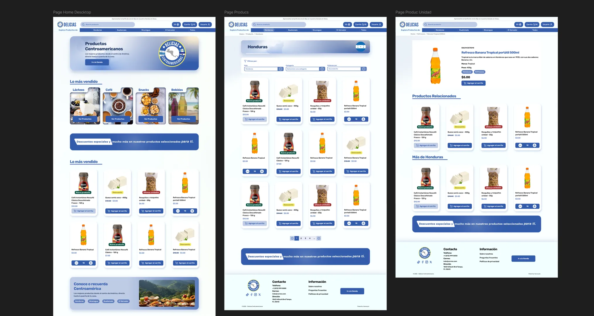
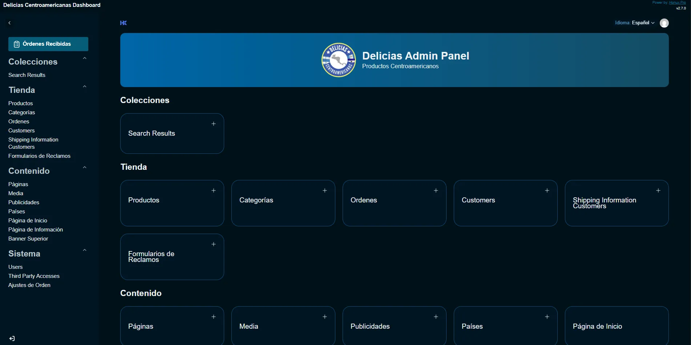
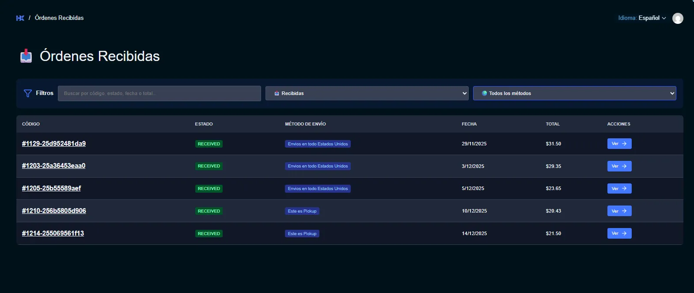
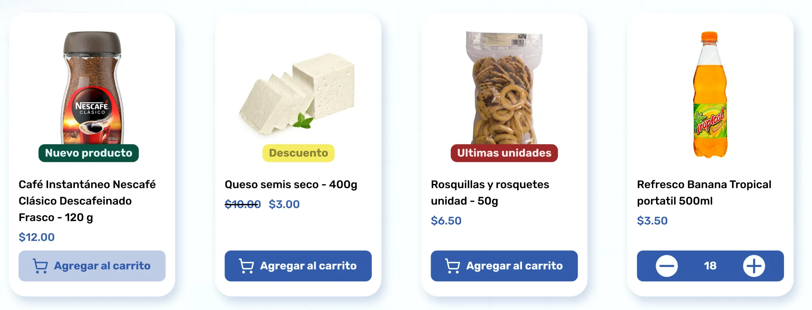
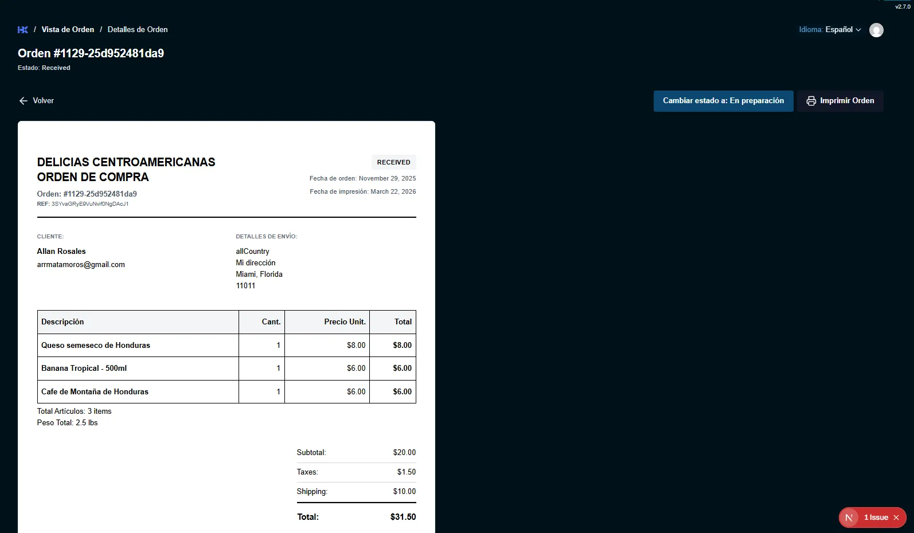

# Descripción del Proyecto
**Delicias Centroamericanas** es una plataforma de e-commerce en Estados Unidos dedicada a la venta de productos nostálgicos comestibles de la región centroamericana. El objetivo principal fue digitalizar el modelo de negocio, permitiendo a los clientes realizar compras en línea con tres modalidades de entrega: recogida en tienda, envíos locales y envíos nacionales.

### Requisitos Clave
* **Experiencia Bilingüe:** Interfaz y catálogo disponibles en español e inglés.
* **Gestión Logística:** Control, revisión e impresión de órdenes en tiempo real.
* **Flexibilidad de Compra:** Opciones para usuarios registrados y compras como invitado.
* **Omnicanalidad:** Configuración dinámica de reglas de envío según la ubicación del cliente.

---

## Diseño y Concepto
El proceso inició en **Figma**, desarrollando una interfaz alineada al branding del cliente. Se priorizó un concepto **minimalista e intuitivo**, diseñado para ser accesible para clientes de todas las edades, independientemente de sus conocimientos tecnológicos.

---

## Arquitectura de Contenido Dinámico (Block-Based CMS)
Uno de los pilares del proyecto es la **flexibilidad administrativa**. El sitio fue construido bajo una arquitectura de bloques:
* **Gestión Visual:** Los administradores pueden gestionar no solo los productos, sino toda la estructura del sitio a través de bloques en **Payload CMS**. 
* **Renderizado en Astro:** Cada componente visual del frontend corresponde a un bloque del CMS, permitiendo al cliente modificar la información y el orden de las secciones sin depender de nuevas líneas de código.
* **Control Total:** El panel administrativo permite gestionar tipos de envío, costos, datos requeridos para la entrega y cupones de descuento globales o específicos.

---

## Desafíos Técnicos y Soluciones
* **Sincronización Bilingüe:** Arquitectura de contenido escalable para múltiples idiomas.
* **Búsqueda Optimizada:** Se implementó un sistema de búsqueda donde los productos se cachean con descripciones y **palabras clave ocultas**. Esto incluye variaciones ortográficas o sinónimos para asegurar que el usuario siempre encuentre el producto deseado.
* **Gestión de Inventario Inteligente:** Los administradores controlan stock actual, niveles mínimos y precios. El sistema permite aplicar descuentos individuales que se visualizan automáticamente mediante etiquetas dinámicas para el usuario final.
* **Rendimiento (Performance):** Optimización de imágenes y recursos para garantizar tiempos de carga rápidos a través de Cloudflare.

---

## Arquitectura y Flujo de Trabajo

1. **Gestión de Carrito:** Persistencia en el cliente mediante **Zustand**, optimizando el rendimiento al evitar peticiones innecesarias al servidor durante la selección de productos.
2. **Validación de Stock:** Al iniciar el *checkout*, el sistema realiza una validación de disponibilidad en tiempo real antes de proceder al pago en **Stripe**.
3. **Automatización con Webhooks:** Tras un pago exitoso, el webhook de Stripe notifica al backend, el cual actualiza el estatus de la orden, dispara correos de notificación y genera una vista personalizada para la gestión e impresión del pedido en el panel.
4. **Mantenimiento Automatizado (Cron Jobs):** Se implementó una tarea programada en el servidor que se ejecuta durante la madrugada. Este proceso identifica órdenes inactivas sin pago confirmado, eliminando automáticamente tanto el registro en la base de datos de Payload CMS como la intención de pago (Payment Intent) en Stripe, manteniendo el sistema limpio y eficiente.
5. **Seguimiento del Cliente:** Enlaces únicos de rastreo y un historial detallado para usuarios registrados que muestra el avance en tiempo real.

---

## Stack Tecnológico
* **Astro:** Framework principal para el frontend (SSG/SSR).
* **Payload CMS:** Headless CMS para la administración total de contenido y bloques estructurales.
* **React:** Utilizado para la interactividad de los componentes dinámicos y la lógica de bloques.
* **Zustand:** Manejo eficiente del estado global del carrito.
* **TailwindCSS:** Framework de utilidades para un diseño responsive ágil.
* **Astro Actions:** Comunicación segura y autenticada entre el cliente y el servidor.
* **Cloudflare:** CDN encargado de la optimización, seguridad y entrega de contenido.

---

## Aprendizajes y Resultados
* **Autonomía del Cliente:** Se logró reducir la dependencia del desarrollador en un 90% para cambios de contenido y promociones gracias a la arquitectura basada en bloques.
* **Eficiencia Operativa:** La integración de la impresión automática de órdenes y las tareas programadas de limpieza optimizaron el flujo administrativo del negocio.
* **Experiencia de Usuario:** La implementación de la búsqueda mediante palabras clave invisibles mejoró la tasa de conversión, asegurando que productos con nombres regionales variados fueran siempre localizados.